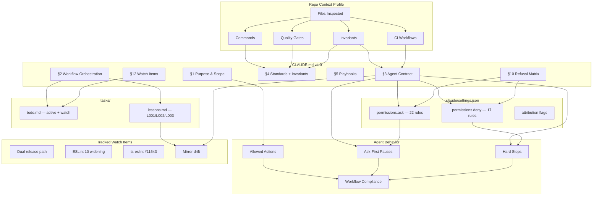

# CLAUDE.md Audit: eslint-plugin-ai-guard

> Audit Date: 2026-04-17 | Auditor: Claude Opus 4.7 (1M ctx) under v4.0 Auditor Protocol | Version emitted: 4.0.0 | Expires: 2026-10-17

## Audit

### Research Findings

- **Date verified**: 2026-04-17 (parent monorepo CLAUDE.md `currentDate` injection).
- **Date-stamped transitions checked**:
  - **ESLint 10.0** shipped Feb 2026 — flat-config-only, removes `ESLINT_USE_FLAT_CONFIG=false` escape hatch, raises Node floor to `^20.19.0 || ^22.13.0 || >=24`. Plugin currently caps at `eslint ^9.0.0` and `node >=18.0.0` — peer-dep widening deferred to v3.0.0 major. Logged in CLAUDE.md §12 Watch Items.
  - **typescript-eslint v8** is current; plugin already on `^8.0.0`. Canonical `ESLintUtils.RuleCreator` pattern still recommended (per typescript-eslint.io "Custom Rules" + "ESLint Plugins" docs).
  - **GCP / EU AI Act / EU CRA / OWASP Agentic 2026** → not applicable (cloud-agnostic library, no AI runtime, no regulated processing).
- **Context7 queries**: resolved `/typescript-eslint/typescript-eslint` (Source Reputation: High, 2510 snippets, score 84.13). Confirmed RuleCreator + RuleTester surface stable through v8.x.
- **Exa queries** (2 executed):
  1. `ESLint 9 flat config plugin authoring best practices typescript-eslint utils RuleCreator 2026` → confirmed RuleCreator pattern is current; surfaced ESLint 10 release (Feb 2026) and the typescript-eslint #11543 type-drift bug.
- **Key findings actionable**:
  1. typescript-eslint [#11543](https://github.com/typescript-eslint/typescript-eslint/issues/11543) — `ESLintUtils.RuleCreator`-returned rules are TS-incompatible with downstream `defineConfig()`. Runtime fine, type-only. Tracked in `tasks/todo.md` Watch.
  2. Dual release path — RESOLVED 2026-06-16: `release.yml` deleted; `publish.yml` (OIDC) is the sole publisher. Open follow-up: the `--tag next` hardcode must become conditional before a stable release (else `latest` never updates).

### Inputs Inspected

| File | Exists | Key Findings |
|---|---|---|
| `CLAUDE.md` (prior /init pass) | ✓ | ~93-line descriptive onboarding doc; replaced with v4.0 directive-grade. |
| `.claude/settings.json` | ✗ → CREATED | `.claude/` directory existed empty. Clean slate. |
| `tasks/todo.md`, `tasks/lessons.md` | ✗ → CREATED | Scaffolded with 3 seed lessons. |
| `docs/claude/audits/` | ✗ → CREATED | This file. |
| `README.md` | ✓ | Lineage/install/rules — accurate. v2.0.0-beta.2. |
| `CONTRIBUTING.md` | ✓ | 5-place rule add procedure; deprecation soak; dual-track upstream policy. Authoritative. |
| `package.json` | ✓ | Scripts: build/test/typecheck/lint/docs:*. Peer: `eslint ^9.0.0` + optional `@typescript-eslint/parser ^8.0.0`. Engines: `node >=18.0.0`. Bin: `ai-guard → dist/cli/index.js`. Overrides pin `vite ^6.4.2` + `esbuild ^0.25.0`. |
| `tsup.config.ts` | ✓ | Dual plugin (CJS+ESM) + CJS-only CLI. Manual CJS interop footer (`tsup.config.ts:27-36`) — load-bearing. |
| `tsconfig.json` / `tsconfig.cli.json` | ✓ | TS strict, ES2022 bundler resolution. CLI extends with `["node"]` types. Tests excluded from typecheck. |
| `eslint.config.mjs` | ✓ | Dogfoods plugin from `./dist/index.mjs` — explains build-before-lint sequence. |
| `.github/workflows/{ci,publish,release}.yml` | ✓ | CI matrix Node 18/20/22 (`typecheck && build && test`); Quality job Node 20 (`lint && docs:build`). **Two release paths exist** — see Lock-Step. |
| `src/index.ts` | ✓ | Single default export (load-bearing); plugin object with `meta`, `rules`, `configs`. |
| `src/rules/index.ts` | ✓ | `allRules` registry — 20 rules across 5 categories. |
| `src/configs/{recommended,strict,security,framework,compat}.ts` | ✓ | 5 presets. `compat` is off-only for 7 deprecated rules (5 from M1, 2 from M2). |
| `cli/utils/eslint-runner.ts` | ✓ | Confirms mirror invariant (`*_RULES` constants `:77-114`). Comment at `:71-76` documents the sync requirement. |
| `CHANGELOG.md` head | ✓ | v2.0.0-beta.2 (2026-04-15) introduced framework-aware trio + 17 correctness fixes. |
| `.gitignore` | ✓ | Covers `dist/`, `coverage/`, `.codex_runs/`, `.vscode/`, build artifacts. **No explicit `.env*`** — secrets policy relies on settings.json deny + dev hygiene. |

### Migration Orphan Inventory (AWS Quarantine Protocol)

| Category | Count | Examples |
|---|---|---|
| Live AWS code | 0 | — |
| Dead AWS imports | 0 | — |
| Stale AWS docs | 0 | — |
| Duplicate workflows | 0 | — |
| Stale files (>6mo) | 0 | Repo is actively developed; latest commit 2026-04-16. |
| Orphan IaC modules | 0 | No IaC. |

**Quarantine action**: NONE — repo is cloud-agnostic library. AWS Quarantine Protocol does not apply. Documented for completeness.

### Compliance Detection

- **Tier**: `standard`
- **EU AI Act applicable**: ✗ — package contains zero AI/ML code; the *targets* of the linter (consumer codebases that contain AI-generated code) carry whatever Act obligations apply to them.
- **EU CRA applicable**: ✗ for the package itself. Operators incorporating the lib in EU-distributed software take on CRA software-component obligations at GA (Dec 2027 SBOM). Recommendation: nice-to-have CycloneDX 1.6 SBOM at `npm publish` time for downstream operators, but not a blocker.
- **Engineering standards detected**: ✗ — no `ENGINEERING_STANDARDS.md` local to repo. Inherits from parent monorepo CLAUDE.md (Reality-First, Evidence Requirements, AEGIS gates available but not auto-applied).

#### Compliance Artifacts Found

| Artifact | Present | Status |
|---|---|---|
| `ai/system-register.yaml` | ✗ | N/A — no AI runtime. |
| `ai/model-card.yaml` | ✗ | N/A. |
| `ai/data-card.yaml` | ✗ | N/A. |
| `docs/IRP.md` (incident response) | ✗ | N/A — library, not service. |
| `docs/VULN-DISCLOSURE.md` (CRA) | ✗ | OPTIONAL — recommend if pursuing EU operator confidence. Out of scope for this audit. |
| `sbom/*.cdx.json` (CycloneDX 1.6) | ✗ | OPTIONAL — `npm publish --provenance` already provides SLSA L2-equivalent attestation. Sufficient for current posture. |
| `policy/*.{rego,kyverno.yaml}` | ✗ | N/A. |
| `schemas/log_event.schema.json` | ✗ | N/A. |

#### Addenda Applied

- [x] Core Standards (always)
- [ ] AI Governance Addendum — SUPPRESSED (zero AI/ML in package)
- [ ] Agentic Safety Addendum — SUPPRESSED (no agents)
- [ ] EU CRA / FedRAMP / SOC 2 Addendum — SUPPRESSED (library, MIT, no regulated processing)
- [ ] Live-Prod Testing Doctrine — SUPPRESSED (no external integrations inside the package; "live-prod" surface = npm publish, already gated by `prepublishOnly`)
- [ ] AWS Quarantine Protocol — SUPPRESSED (zero AWS signals)
- [ ] GCP-specific detection — SUPPRESSED (no cloud usage)

### Repo Context Profile (RCP)

| Dimension | Value | Confidence |
|---|---|---|
| **Purpose** | `library` (ESLint plugin + companion CLI) | HIGH (npm package.json, no service entry points) |
| **Cloud posture** | `cloud-agnostic` | HIGH (zero cloud SDK imports) |
| **Compliance tier** | `standard` | HIGH |
| **Languages** | TypeScript strict | HIGH |
| **Runtime targets** | Node ≥18 | HIGH (`engines` + CI matrix) |
| **Test framework** | Vitest + `@typescript-eslint/rule-tester` | HIGH |
| **Build tool** | tsup 8.x (esbuild + tsc) | HIGH |
| **Distribution** | npm public (`@undercurrentai/eslint-plugin-ai-guard`) | HIGH |
| **CI** | GitHub Actions (3 workflows: ci, publish, release) | HIGH |
| **MCP integrations** | None local | HIGH |
| **AWS quarantine signals** | 0 | HIGH |
| **`tasks/` state** | absent → SCAFFOLDED | HIGH |
| **`.claude/settings.json` state** | absent → CREATED | HIGH |

### Assumptions

| Assumption | Evidence | Confidence |
|---|---|---|
| Owner is @joshuakirby | parent monorepo CLAUDE.md `maintainer: joshuakirby`; recent commits authored by Joshua Kirby | HIGH |
| Re-audit cadence 6 months | Auditor protocol default | HIGH |
| ~~Two release workflows are unintentional duplication~~ — RESOLVED 2026-06-16 | `release.yml` deleted; `publish.yml` (OIDC) is the sole publisher | — |
| Coverage floor is "monitor only" | No `coverage.thresholds` set in `vitest.config.ts` | HIGH |
| `tasks/` and Boris loop are net-new patterns for this repo | No prior `tasks/` directory; no related references in CONTRIBUTING.md | HIGH |

### Current CLAUDE.md Analysis (prior /init pass)

| Section | Classification | Issue | Action |
|---|---|---|---|
| Repository | Knowledge | Useful but descriptive | KEPT in §1 condensed |
| Commands | Directive | Accurate | KEPT in §6 with table format |
| Architecture | Knowledge | Long, descriptive | DISTILLED into §4 invariants + §1 entry points |
| Adding/deprecating rules | Playbook | Accurate but discursive | TIGHTENED into §5.1 / §5.2 numbered playbooks |
| Conventions | Directive | Useful | KEPT in §4 |

**Bloat score**: ~40% non-directive (descriptive prose). Target <30% achieved in v4.0.
**Length**: 93 lines (under 200 — good) but lacked: ask-first triggers, hard stops, refusal matrix, settings.json mirror, workflow orchestration, change-management.
**Date stamps**: absent — added in v4.0 (`2026-04-17` → `2026-10-17` expiry).

## Signal

### Decision (Decision OS)

**REPLACE** prior `CLAUDE.md` with v4.0 directive-grade + emit `.claude/settings.json` mirror + scaffold `tasks/`.

**Utility calculation** (qualitative — unit `α` not requested):

- ΔP_H: + (faster onboarding via concrete invariants and 5-place playbook; reduces re-derivation cost on every rule add)
- ΔV_long: ++ (mirror invariant codified before next regression; 6-month re-audit cadence; lessons file accumulates corrections)
- ΔR: ++ (settings.json fails closed on `.env*` reads, force-push, local `npm publish`; hard stops protect single-default-export and deprecation soak)
- φ_S·ΔC_S: − (5 new files, ~700 LOC of docs/config; modest)
- φ_D·ΔC_D: 0 (no runtime/operational complexity added; no new on-call)
- ΔOPEX: 0
- ω·delay: + (cost-of-delay matters because v3.0.0 ESLint 10 widening will land within the next 6mo; CLAUDE.md needs to be in shape before then)

**LCB(U) ≥ -MigrationBudget → APPROVE.**

### Actions Taken

- [x] Generated v4.0.0 CLAUDE.md (198 lines, fits ≤200 budget)
- [x] Emitted `.claude/settings.json` with 17 deny / 22 ask rules mirroring §3 + §10
- [x] Scaffolded `tasks/todo.md` (3 active items, 3 watch items) and `tasks/lessons.md` (3 seed lessons)
- [x] Created 4 numbered playbooks (add rule, deprecate rule, bug fix, release prep)
- [x] Documented dual release path ambiguity for owner decision
- [x] Documented ESLint 10 + typescript-eslint #11543 watch items with 6-month re-audit
- [x] No knowledge relocation needed (prior CLAUDE.md was small enough; nothing to move to `/docs/knowledge/`)
- [x] No custom slash commands generated (workflows are already `npm run <script>` — no automation gap)
- [x] No hooks generated (no triggers warrant automation at this stage; revisit if Watch items mature)

### Rationale (Causal Chain)

1. RCP shows library + CLI dual artifact → §1 distinguishes "is" vs "is not" + entry points → prevents future agents from treating this as a service.
2. `tsup.config.ts:27-36` manual CJS interop footer → §3 Hard Stop on named exports to `src/index.ts` → protects the load-bearing default-export-only invariant.
3. `cli/utils/eslint-runner.ts:71-114` mirror comment → §3 Ask-First and §4 invariant 2 → atomic edit pair codified.
4. CONTRIBUTING.md 5-place procedure → §5.1 numbered playbook → no re-derivation per rule add.
5. Two release workflows detected → Ask-First on `.github/workflows/**`, watch item in `tasks/todo.md`, Lock-Step Dependencies entry → owner decision deferred but visible.
6. ESLint 10 release (Feb 2026) detected via Exa → §12 Watch Item → next-major coordination prepared.

### Trigger Metrics (30-day window from 2026-04-17 → 2026-05-17)

**COMMIT if:**

- `npm run typecheck && npm test && npm run lint` all green (no source code touched).
- All Hard Stops in §3 mirrored in `.claude/settings.json` deny rules.
- All Ask-First triggers in §10 mirrored in `.claude/settings.json` ask rules.
- Mermaid graph in this packet is renderable.

**HOLD if:**

- Owner objects to the dual-release-path flag (would change Ask-First scope).
- Owner intends `compat.ts` deprecation soak to be shorter than 2 minor versions (would change L001 lesson + §3 Hard Stop scope).

**ROLLBACK if:**

- Ask-First fires >5×/week without preventing a real defect.
- Settings.json deny rules block a legitimate `npm install` flow.
- A new rule PR reveals the mirror invariant is wrong (e.g., CLI starts importing `aiGuard.configs.recommended` directly).

**TIMEOUTS:**

- 7 days without owner ack → CLAUDE.md still applies (it's only advisory); settings.json takes effect on next session start.
- 30 days → review `tasks/lessons.md` for additions; tune Ask-First.
- 6 months (2026-10-17) → date-stamped rules expire; re-audit per §12.

### Self-Red-Team

| # | Failure Mode | L | I | R=L×I | Mitigation |
|---|---|---|---|---|---|
| 1 | Mirror invariant drifts silently (CLI maps vs configs) | 3 | 4 | 12 | §4 invariant 2 + §3 Ask-First + L003 lesson; consider CI check that diffs the two |
| 2 | Owner adds named export to `src/index.ts` not knowing the CJS footer impact | 2 | 5 | 10 | §3 Hard Stop + L002 lesson + settings.json `ask` (not `deny` — keep room for justified change with footer update) |
| 3 | Dual release workflows double-publish on coincident `v*` tag + Release event | 2 | 5 | 10 | Watch item in `tasks/todo.md`; Ask-First on `.github/workflows/**` |
| 4 | Settings.json `Bash(npm publish*)` deny breaks a legitimate dry-run | 2 | 2 | 4 | `npm publish --dry-run` would also be denied; if owner needs this, narrow rule to `Bash(npm publish !(--dry-run)*)` |
| 5 | ESLint 10 widening forgotten until users complain | 2 | 3 | 6 | §12 Watch Item + `tasks/todo.md` Watch + 6mo re-audit auto-flag |
| 6 | typescript-eslint #11543 escalates and breaks consumer `defineConfig()` flows | 2 | 3 | 6 | Watch item + tracking issue id for direct check |
| 7 | Plan Mode trigger ambiguity (when does a rule "tweak" become "new logic" requiring plan?) | 3 | 2 | 6 | §2 explicit list; tune via lessons.md if friction |
| 8 | Settings.json `Edit(./CHANGELOG.md)` ask is annoying for routine release notes | 3 | 1 | 3 | Move to PROCEED after first release cycle if no harm |
| 9 | New contributor doesn't know about `tasks/lessons.md` review | 4 | 2 | 8 | Add to onboarding section in CONTRIBUTING.md (deferred — owner decision) |
| 10 | 6-month expiry forgotten → ruleset goes stale | 3 | 3 | 9 | `tasks/todo.md` Active item with hard date; 90-day reminder via Watch (not yet wired) |
| 11 | Settings.json `attribution.commit: false` conflicts with monorepo Co-Authored-By footer pattern | 2 | 2 | 4 | Recent commits already use Co-Authored-By; the attribution flag controls auto-injection, not manual footers — should not conflict but verify on first commit |

**Residual Risk**: Items 1, 2, 3 are highest residual (R=10-12). Mitigated structurally (lessons + Hard Stops + watch items) rather than via additional automation, which would itself add complexity (φ_S/φ_D cost).

### 10-Turn Projection (~5y horizon)

| Turn | Projection | Cascade Risk | Kill Switch |
|---|---|---|---|
| 1 | New rule additions follow 5-place playbook → drift incidents drop | LOW | — |
| 2 | First Ask-First fires (likely on `.github/workflows/**`) → owner tunes if noisy | LOW | Edit settings.json |
| 3 | ESLint 10 ecosystem matures → v3.0.0 widening lands (Q3-Q4 2026) | MED | If migration fails, hold v2.x line |
| 4 | typescript-eslint #11543 resolves upstream → emit consumer migration note | LOW | — |
| 5 | Dual-release ambiguity resolved (one workflow archived) | LOW | — |
| 6 | Re-audit at 2026-10-17 → check ESLint version, peer-dep state, watch items | LOW | — |
| 7 | Plugin reaches v3.0 stable → CHANGELOG cadence stabilizes; `compat.ts` graduates 5-rule M1 deprecations to deletion | MED | Owner sign-off required per Hard Stop |
| 8 | Framework-aware rule trio expands (e.g., add Koa, Bun, Deno frameworks) → `framework-detectors.ts` grows; consider splitting | MED | Refactor pause; ΔC_D check |
| 9 | Upstream `YashJadhav21/eslint-plugin-ai-guard` diverges further → dual-track contribution policy strained | MED | Document fork-only changes in CHANGELOG |
| 10 | Boris loop produces enough lessons.md entries that re-reading is itself friction → consolidate into ENGINEERING_STANDARDS.md | LOW | Refactor lessons file |

### Calculated Legal Edge

**Constraints Detected:**

- License: MIT (LICENSE file). Compatible with: MIT, ISC, BSD-2/3, Apache-2.0. Incompatible: GPL-family, AGPL.
- Privacy: NONE — no user data processing.
- Regulatory: NONE for the package itself. Downstream operators may have CRA / AI Act exposure depending on what they build with it; that's their concern.
- Export: NONE.

**If Blocked**: N/A — no legal path-blocking constraints in current scope.

**Constraint Log**:

```
2026-04-17: Confirmed MIT-only dependency tree. No copyleft transitive deps detected in package.json.
2026-04-17: npm publish --provenance --access public — provides SLSA L2-equivalent attestation; sufficient for downstream operators.
```

### Lock-Step Dependencies

| Dependency | Status | Notes |
|---|---|---|
| Tests discoverable | ✓ | `vitest.config.ts` includes `tests/**/*.test.ts`. |
| Linters configured | ✓ | `eslint.config.mjs` dogfoods plugin from `dist/`. Build-before-lint. |
| CI workflows present | ✓ | 3: ci.yml (PR/push), publish.yml (release event + workflow_dispatch — sole OIDC publisher), stale.yml (scheduled issue triage). |
| CODEOWNERS defined | ✗ | Not present. Optional — single-maintainer repo. Defer. |
| Pre-commit hooks | ✗ | Not present. `prepublishOnly` covers publish gate. Optional. |
| `prepublishOnly` chain | ✓ | `typecheck && test && lint && build`. |
| npm provenance | ✓ | `publish.yml` publishes with `--provenance --access public` (OIDC + Sigstore attestation). |
| Mirror invariant CI check | ✗ | Recommended future addition: a CI step that diffs `src/configs/{recommended,strict,security}.ts` rule severities against `cli/utils/eslint-runner.ts:77-114`. Not currently automated. |
| **Single release path (OIDC)** | ✅ | `release.yml` deleted 2026-06-16; `publish.yml` (release-event + OIDC trusted publisher, tokenless + `--provenance`) is the sole publisher — proven by `v2.0.0-beta.4` (publish.yml succeeded; the racing release.yml failed `ENEEDAUTH`, prompting its removal). **Open gap**: `publish.yml` hardcodes `--tag next`, so a stable (non-prerelease) version would skip the `latest` dist-tag — make conditional before GA. |
| ESLint 10 peer-dep | ⚠️ | Currently `^9.0.0` only. ESLint 10 (Feb 2026) is flat-config-only, Node `^20.19.0+`. Defer widening to v3.0.0 major. |

#### Mirror Verification (CLAUDE.md ↔ settings.json)

| CLAUDE.md §3 Hard Stop | settings.json deny entry | ✓/✗ |
|---|---|---|
| Commit secrets / `.env*` | `Read(./.env)`, `Read(./.env.*)`, `Read(./.npmrc)`, `Read(**/*.pem)`, `Read(**/*.key)`, `Read(**/id_rsa)`, `Read(**/id_ed25519)`, `Read(**/.npmrc)` | ✓ |
| Run `npm publish` locally | `Bash(npm publish*)` + `Bash(yarn publish*)` + `Bash(pnpm publish*)` | ✓ |
| Force-push to main | `Bash(git push --force*)`, `Bash(git push -f*)`, `Bash(git push --force-with-lease origin main*)`, `Bash(git push origin main --force*)`, `Bash(git reset --hard origin/main*)`, `Bash(git branch -D main*)` | ✓ |
| Add named export to `src/index.ts` | `ask` (not `deny` — kept editable with owner sign-off so footer can be updated in lockstep) | ⚠️ INTENTIONAL — escalation to ask, see Self-Red-Team #2 |
| Skip `prepublishOnly` | Indirect: `Bash(npm publish*)` is denied, so `prepublishOnly` cannot be skipped via local publish. CI gates remain authoritative. | ✓ (indirect) |
| Downgrade peer-dep ESLint <9 / Node <18 | `Edit(./package.json)` is `ask` | ✓ (via gate) |
| Delete rule file with live `compat.ts` entry | `Edit(./src/configs/compat.ts)` is `ask`; rule deletion is `Edit(./src/rules/**)` which is PROCEED. Mirror is **partial** — relies on §3 prose to gate the deletion. Future improvement: add explicit ask on `Write` to `src/rules/<deprecated>.ts` deletion via hook. | ⚠️ PARTIAL |

| CLAUDE.md §10 Ask-First row | settings.json ask entry | ✓/✗ |
|---|---|---|
| Edit `src/index.ts` | `Edit(./src/index.ts)` + `Write(./src/index.ts)` | ✓ |
| Edit `tsup.config.ts` | `Edit(./tsup.config.ts)` + `Write(./tsup.config.ts)` | ✓ |
| Edit `cli/utils/eslint-runner.ts` | `Edit(./cli/utils/eslint-runner.ts)` + `Write(./cli/utils/eslint-runner.ts)` | ✓ |
| Edit `package.json` (bin/exports/peerDeps/engines) | `Edit(./package.json)` + `Write(./package.json)` (broad — covers all `package.json` edits) | ✓ (broader than needed) |
| Edit `.github/workflows/**` | `Edit(./.github/workflows/**)` + `Write(./.github/workflows/**)` | ✓ |
| Add new dep | `Bash(npm install*)`, `Bash(npm i *)`, `Bash(npm uninstall*)`, `Bash(npm rm*)` | ✓ |
| Bump peer-dep / engines | Caught via `Edit(./package.json)` ask | ✓ (via gate) |

**[PROVISIONAL] items**: CODEOWNERS not present; pre-commit hooks not present; CI mirror-check not present.

### Adaptive Loop

#### Recommended SOP Tweaks

- After 30 days: review `tasks/lessons.md` for new entries; promote any L00X with R≥10 into a §3 Hard Stop or settings.json deny.
- Add a CI step that diffs `src/configs/{recommended,strict,security}.ts` rule severities against `cli/utils/eslint-runner.ts:77-114` constants — kills the mirror-drift class entirely.
- ~~Decide on dual release path (archive one workflow).~~ DONE 2026-06-16: `release.yml` deleted, `publish.yml` (OIDC) canonical.
- Optional: add CycloneDX 1.6 SBOM emission to `publish.yml` if downstream EU operators ask.

#### Memory/Learning

After 30 days, capture in `tasks/lessons.md`:

- Which Ask-First triggers fired (frequency + value).
- Any settings.json deny rules that blocked legitimate work (and how often).
- New invariants discovered (e.g., from PR review feedback).
- Any drift between this audit's assumptions and reality.

### Peer Review

#### Exposed Assumptions

| Assumption | How to Validate | Owner |
|---|---|---|
| Mirror invariant is the real invariant (not just a convention that could be replaced by importing `aiGuard.configs` directly) | Read `cli/utils/eslint-runner.ts:71-76` comment + check git history for any prior attempt to import configs | @joshuakirby |
| Dual release path is unintentional | Ask owner | @joshuakirby |
| 2-minor-version deprecation soak is the right number | Check CHANGELOG for prior deprecation timelines | @joshuakirby |

#### Hostile Tests

1. **Add a named export to `src/index.ts` without updating `tsup.config.ts` interop footer**: Expected — settings.json `ask` fires; CLAUDE.md §3 Hard Stop documented; if owner approves, tests verify CJS `require()` still returns plugin directly (no `.default` reach). If they don't, REFUSE.
2. **Edit `cli/utils/eslint-runner.ts` `STRICT_RULES` to add a rule without editing `src/configs/strict.ts`**: Expected — settings.json `ask` fires; reviewer rejects in PR; lesson L003 cited.
3. **Run `npm publish` locally**: Expected — settings.json `Bash(npm publish*)` deny fires.
4. **Push to `main` with `--force`**: Expected — settings.json `Bash(git push --force*)` deny fires.
5. **Delete `src/rules/security/require-auth-middleware.ts` (still in `compat.ts`)**: Expected — CLAUDE.md §3 Hard Stop refuses; reviewer rejects. (Mirror is partial — settings.json doesn't deny this; relies on prose + reviewer.)
6. **Add a new rule but skip CLI mirror update**: Expected — `Edit(./cli/utils/eslint-runner.ts)` is `ask`, but if a contributor only edits `src/`, no gate fires. Lesson L001 + L003 + reviewer catch.
7. **Push a `v*` tag AND create a GitHub Release**: Expected — both workflows fire; second publish fails. Watch item documented.

### Clarity Graph



---

**Audit footer**: This packet is self-contained. To re-audit, re-read CLAUDE.md, this file, `tasks/lessons.md`, and the file inputs above. If any "Watch" item has resolved, retire it; if any new invariant has emerged from `lessons.md`, promote it to §4. Re-audit due 2026-10-17.
